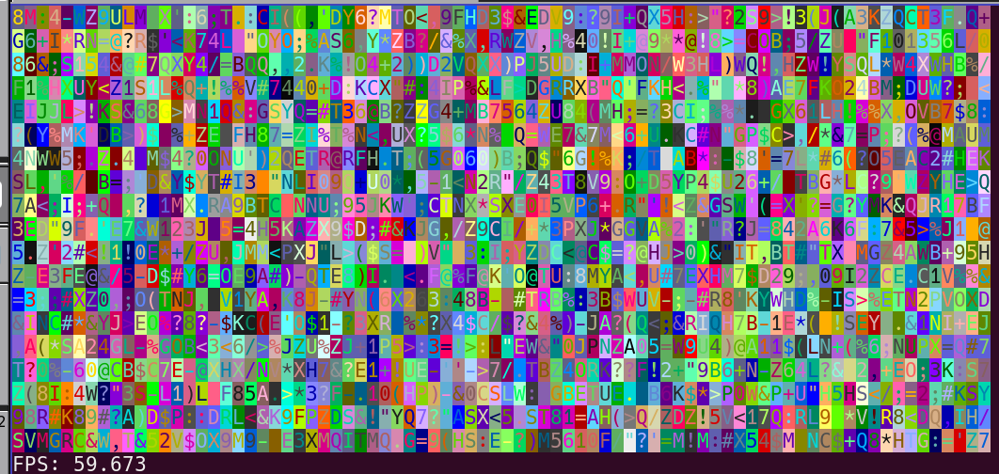
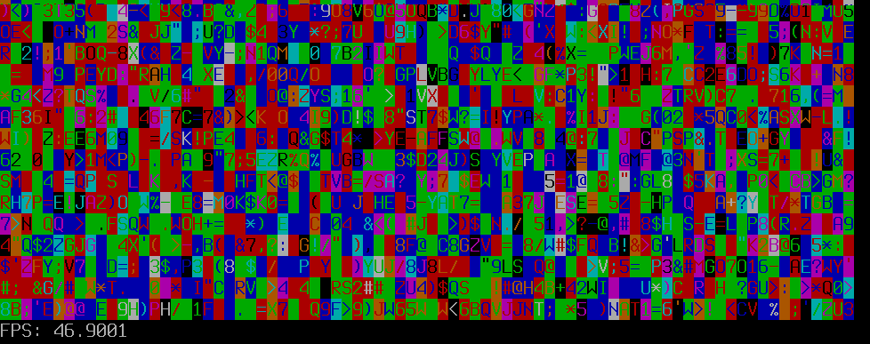
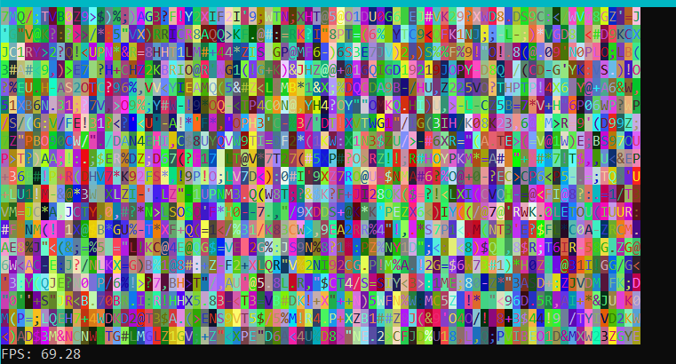

# Table of Contents

- [About The Project](#about-the-project)
- [Usage and Demo](#usage-and-demo)
- [License](#license)
- [Contact](#contact)

## About The Project

Do you want to try some graphics routines but you can't/like install SFML, SDL, or any other graphic library?. Or maybe the next roguelite game.

ConsoleBuffer works in text mode. No external graphics libraries are required, just 2 header files. Use the console as pixel buffer, but shows characters instead of pixel.

Needs ansi.hpp to work. https://github.com/josepuga/ansi

See ansi.hpp to requisites.

## Usage and Demo

Run the demos to watch ConsoleBuffer in action. Some demo screenshots:

Triple ConsoleBuffer Benchmark:

Single ConsoleBuffer 80x20 Benchmark (Linux QTerminal):

Single ConsoleBuffer 80x20 Benchmark (Linux TTY Framebuffer):

Single ConsoleBuffer 80x20 Benchmark (Windows DOS Command):

-- Windows Specs: CPU i7-4790K 4400Mhz. GPU Radeon RX 5600 XT.

-- Linux Specs: 

## License

Distributed under the MIT License.

## Contact

Feel free to send me any feedback.

José Puga - josepuga.programacion@gmail.com
